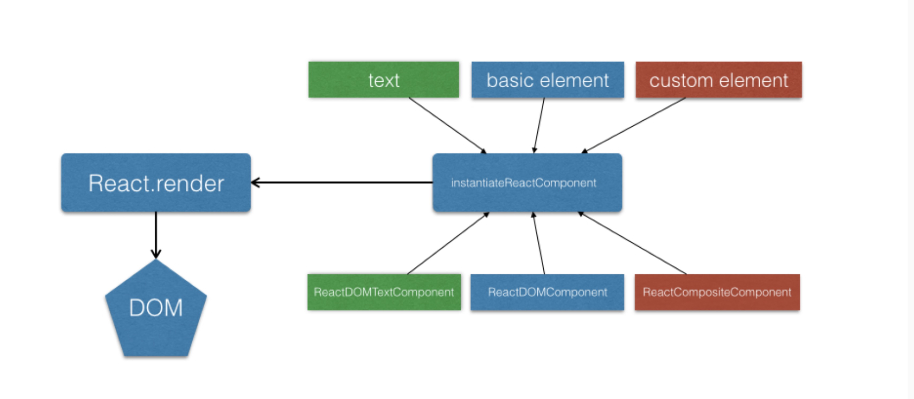

# React 源码分析

## 写在前面

React 开发一年多，最近仔细研究了 React 源码，在这里总结一下原理。React 源码比较复杂不适合初学者去学习。所以本文通过实现一套简易版的 React，使得理解原理更加容易（本文基于 React v15）。包括：

- React 的几种组件以及首次渲染实现
- React 更新机制的实现以及 React diff 算法

React 的代码还是非常复杂的，虽然这里是一个简化版本。但是还是需要有不错的面向对象思维的。React 的核心主要有一下几点。

- 虚拟 dom 对象（Virtual DOM）
- 虚拟 dom 差异化算法（diff algorithm）
- 单向数据流
- 组件声明周期
- 事件处理

[本文代码仓库](https://github.com/Tianlikai/TReact)

- 直接在游览器中打开 main.html 中查看效果
- 更改代码请先执行执行`npm i`安装依赖(使用了部分 es6 代码)
- 修改代码后请执行`npm run dev`重新编译代码

## 实现一个 hello React！的渲染

看如下代码：

```
// js
React.render('hello React！',document.getElementById("root"))

// html
<div id="root"></div>

// 生成代码
<div id="root">
    <span data-reactid="0">hello React!</span>
</div>
```

针对上面代码的具体实现

```
/**
 * component 类
 * 文本类型
 * @param {*} text 文本内容
 */
function ReactDOMTextComponent(text) {
  // 存下当前的字符串
  this._currentElement = "" + text;
  // 用来标识当前component
  this._rootNodeID = null;
}

/**
 * component 类 装载方法,生成 dom 结构
 * @param {number} rootID 元素id
 * @return {string} 返回dom
 */
ReactDOMTextComponent.prototype.mountComponent = function(rootID) {
  this._rootNodeID = rootID;
  return (
    '<span data-reactid="' + rootID + '">' + this._currentElement + "</span>"
  );
};

/**
 * 根据元素类型实例化一个具体的component
 * @param {*} node ReactElement
 * @return {*} 返回一个具体的component实例
 */
function instantiateReactComponent(node) {
  //文本节点的情况
  if (typeof node === "string" || typeof node === "number") {
    return new ReactDOMTextComponent(node);
  }
}

const React = {
 nextReactRootIndex: 0,

 /**
  * 接收一个React元素，和一个dom节点
  * @param {*} element React元素
  * @param {*} container 负责装载的dom
  */
  render: function(element, container) {
    // 实例化组件
    var componentInstance = instantiateReactComponent(element);
    // 组件完成dom装载
    var markup = componentInstance.mountComponent(React.nextReactRootIndex++);
    // 将装载好的 dom 放入 container 中
    $(container).html(markup);
    $(document).trigger("mountReady");
  }
};
```

这里代码分为三个部分：

- 1 React.render 作为入口接受一个 React 元素和游览器中的 dom 负责调用渲染,nextReactRootIndex 为每个 component 的唯一标识
- 2 引入 component 类的概念，ReactDOMTextComponent 是一个 component 类定义。ReactDOMTextComponent 针对于文本节点进行处理。并且在 ReactDOMTextComponent 的原型上实现了 mountComponent 方法，用于对组件的渲染，返回组件的 dom 结构。当然 component 还具有更新和删除操作，这里将在后续讲解。
- 3 instantiateReactComponent 用来根据 element 的类型（现在只有一种 string 类型），返回一个 component 的实例。其实就是个类工厂。

> 在这里我们把逻辑分为几个部分，渲染逻辑则由 component 内部定义，React.render 负责调度整个流程，在调用 instantiateReactComponent 生成一个对应 component 类型的实例对象，再调用对象的 mountComponent 返回 dom，最后再写到 container 节点中

## 虚拟 dom

虚拟 dom 无疑是 React 的核心概念，在代码中我们会使用 React.createElement 来创建一个虚拟 dom 元素。

虚拟 dom 分为两种一种是游览器自带的基本元素比如 div，还有一种是自定义元素（文本节点不算虚拟 dom）

虚拟节点的使用方式

```
// 绑定事件监听方法
function sayHello(){
    alert('hello!')
}
var element = React.createElement('div',{id:'jason',onclick:hello},'click me')
React.render(element,document.getElementById("root"))

// 最终生成的html

<div data-reactid="0" id="jason">
    <span data-reactid="0.0">click me</span>
</div>
```

我们使用 React.createElement 来创建一个虚拟 dom 元素，以下是简易实现

```
/**
 * ReactElement 就是虚拟节点的概念
 * @param {*} key 虚拟节点的唯一标识，后期可以进行优化
 * @param {*} type 虚拟节点类型，type可能是字符串（'div', 'span'），也可能是一个function，function时为一个自定义组件
 * @param {*} props 虚拟节点的属性
 */
function ReactElement(type, key, props) {
  this.type = type;
  this.key = key;
  this.props = props;
}

const React = {
  nextReactRootIndex: 0,
  /**
   * @param {*} type 元素的 component 类型
   * @param {*} config 元素配置
   * @param {*} children 元素的子元素
   */
  createElement: function(type, config, children) {
    var props = {};
    var propName;
    config = config || {};

    var key = config.key || null;

    for (propName in config) {
      if (config.hasOwnProperty(propName) && propName !== "key") {
        props[propName] = config[propName];
      }
    }

    var childrenLength = arguments.length - 2;
    if (childrenLength === 1) {
      props.children = Array.isArray(children) ? children : [children];
    } else if (childrenLength > 1) {
      var childArray = [];
      for (var i = 0; i < childrenLength; i++) {
        childArray[i] = arguments[i + 2];
      }
      props.children = childArray;
    }
    return new ReactElement(type, key, props);
  },

  /**
   * 自行添加上文中的render方法
   */
};
```

> createElement 方法对传入的参数做了一些处理，最终会返回一个 ReactElement 虚拟元素实例，key 的定义可以提高更新时的效率

有了虚拟元素实例，我们需要改造一下 instantiateReactComponent 方法

```
/**
 * 根据元素类型实例化一个具体的component
 * @param {*} node ReactElement
 * @return {*} 返回一个具体的component实例
 */
function instantiateReactComponent(node) {
  //文本节点的情况
  if (typeof node === "string" || typeof node === "number") {
    return new ReactDOMTextComponent(node);
  }
  //浏览器默认节点的情况
  if (typeof node === "object" && typeof node.type === "string") {
    //注意这里，使用了一种新的component
    return new ReactDOMComponent(node);
  }
}
```

> 我们增加了一个判断，这样当 render 的不是文本而是浏览器的基本元素时。我们使用另外一种 component 来处理它渲染时应该返回的内容。这里就体现了工厂方法 instantiateReactComponent 的好处了，不管来了什么类型的 node，都可以负责生产出一个负责渲染的 component 实例。这样 render 完全不需要做任何修改，只需要再做一种对应的 component 类型（这里是 ReactDOMComponent）就行了。

`ReactDOMComponent`的具体实现

```
/**
 * component 类
 * react 基础标签类型，类似与html中的（'div','span' 等）
 * @param {*} element 基础元素
 */
function ReactDOMComponent(element) {
  // 存下当前的element对象引用
  this._currentElement = element;
  this._rootNodeID = null;
}

/**
 * component 类 装载方法
 * @param {*} rootID 元素id
 * @param {string} 返回dom
 */
ReactDOMComponent.prototype.mountComponent = function(rootID) {
  this._rootNodeID = rootID;
  var props = this._currentElement.props;

  // 外层标签
  var tagOpen = "<" + this._currentElement.type;
  var tagClose = "</" + this._currentElement.type + ">";

  // 加上reactid标识
  tagOpen += " data-reactid=" + this._rootNodeID;

  // 拼接标签属性
  for (var propKey in props) {
    // 属性为绑定事件
    if (/^on[A-Za-z]/.test(propKey)) {
      var eventType = propKey.replace("on", "");
      // 对当前节点添加事件代理
      $(document).delegate(
        '[data-reactid="' + this._rootNodeID + '"]',
        eventType + "." + this._rootNodeID,
        props[propKey]
      );
    }

    // 对于props 上的children和事件属性不做处理
    if (
      props[propKey] &&
      propKey != "children" &&
      !/^on[A-Za-z]/.test(propKey)
    ) {
      tagOpen += " " + propKey + "=" + props[propKey];
    }
  }
  // 渲染子节点dom
  var content = "";
  var children = props.children || [];

  var childrenInstances = []; // 保存子节点component 实例
  var that = this;

  children.forEach((child, key) => {
    var childComponentInstance = instantiateReactComponent(child);
    // 为子节点添加标记
    childComponentInstance._mountIndex = key;
    childrenInstances.push(childComponentInstance);
    var curRootId = that._rootNodeID + "." + key;

    // 得到子节点的渲染内容
    var childMarkup = childComponentInstance.mountComponent(curRootId);

    // 拼接在一起
    content += " " + childMarkup;
  });

  // 保存component 实例
  this._renderedChildren = childrenInstances;

  // 拼出整个html内容
  return tagOpen + ">" + content + tagClose;
};
```

对于虚拟 dom 的渲染逻辑，本质上还是个递归渲染的东西，reactElement 会递归渲染自己的子节点。可以看到我们通过 instantiateReactComponent 屏蔽了子节点的差异，只需要使用不同的 component 类，这样都能保证通过 mountComponent 最终拿到渲染后的内容。

另外这边的事件也要说下，可以在传递 props 的时候传入{onClick:function(){}}这样的参数，这样就会在当前元素上添加事件，代理到 document。由于 React 本身全是在写 js，所以监听的函数的传递变得特别简单。

> 这里很多东西没有考虑，这里为了保持简单就不再扩展了，另外 React 的事件处理其实很复杂，实现了一套标准的 w3c 事件。这里偷懒直接使用 jQuery 的事件代理到 document 上了。

`自定义元素`的实现
随着前端技术的发展浏览器的那些基本元素已经满足不了我们的需求了，如果你对 web components 有一定的了解，就会知道人们一直在尝试扩展一些自己的标记。

React 通过虚拟 dom 做到了类似的功能，还记得我们上面 node.type 只是个简单的字符串，如果是个类呢？如果这个类恰好还有自己的生命周期管理，那扩展性就很高了。

在 React 中使用自定义元素

```
var CompositeComponent = React.createClass({
  getInitialState: function() {
    return {
      count: 0
    };
  },
  componentWillMount: function() {
    console.log("声明周期: " + "componentWillMount");
  },
  componentDidMount: function() {
    console.log("声明周期: " + "componentDidMount");
  },
  onChange: function(e) {
    var count = ++this.state.count;
    this.setState({
      count: count
    });
  },
  render: function() {
    const count = this.state.count;
    var h3 = React.createElement(
      "h3",
      { onclick: this.onChange.bind(this), class: "h3" },
      `click me ${count}`
    );
    var children = [h3];

    return React.createElement("div", null, children);
  }
});

var CompositeElement = React.createElement(CompositeComponent);

var root = document.getElementById("container");

React.render(CompositeElement, root);
```

`React.createElement`接受的不再是字符串，而是一个 class。
React.createClass 生成一个自定义标记类，带有基本的生命周期：

- getInitialState 获取最初的属性值 this.state
- componentWillmount 在组件准备渲染时调用
- componentDidMount 在组件渲染完成后调用

React.createClass 的实现

```
/**
 * 所有自定义组件的超类
 * @function render所有自定义组件都有该方法
 */
function ReactClass() {}

ReactClass.prototype.render = function() {};

/**
 * 更新
 * @param {*} newState 新状态
 */
ReactClass.prototype.setState = function(newState) {
  // 拿到ReactCompositeComponent的实例
  this._reactInternalInstance.receiveComponent(null, newState);
};

const React = {
  nextReactRootIndex: 0,

  /**
   * 创建 ReactClass
   * @param {*} spec 传入的对象
   */
  createClass: function(spec) {
    var Constructor = function(props) {
      this.props = props;
      this.state = this.getInitialState ? this.getInitialState() : null;
    };

    Constructor.prototype = new ReactClass();
    Constructor.prototype.constructor = Constructor;

    Object.assign(Constructor.prototype, spec);
    return Constructor;
  },

  /**
   * 自己上文的createElement方法
   */

  /**
   * 自己上文的render方法
   */
};
```

这里 createClass 生成了一个继承 ReactClass 的子类，在构造函数里调用 this.getInitialState 获得最初的 state。

> 为了演示方便,我们这边的 ReactClass 相当简单，实际上原始的代码处理了很多东西，比如类的 mixin 的组合继承支持,比如 componentDidMount 等可以定义多次，需要合并调用等等，有兴趣的去翻源码吧，不是本文的主要目的，这里就不详细展开了。

看看我们上面的两种类型就知道，我们是时候为自定义元素也提供一个 component 类了，在那个类里我们会实例化 ReactClass，并且管理生命周期，还有父子组件依赖。

首先改造 instantiateReactComponent

```
/**
 * 根据元素类型实例化一个具体的component
 * @param {*} node ReactElement
 * @return {*} 返回一个具体的component实例
 */
function instantiateReactComponent(node) {
  // 文本节点的情况
  if (typeof node === "string" || typeof node === "number") {
    return new ReactDOMTextComponent(node);
  }
  //浏览器默认节点的情况
  if (typeof node === "object" && typeof node.type === "string") {
    // 注意这里，使用了一种新的component
    return new ReactDOMComponent(node);
  }
  // 自定义的元素节点
  if (typeof node === "object" && typeof node.type === "function") {
    // 注意这里，使用新的component,专门针对自定义元素
    return new ReactCompositeComponent(node);
  }
}
```

> 这里我们添加了一个判断，处理自定义类型的 component

ReactCompositeComponent 的具体实现如下

```
/**
 * component 类
 * 复合组件类型
 * @param {*} element 元素
 */
function ReactCompositeComponent(element) {
  // 存放元素element对象
  this._currentElement = element;
  // 存放唯一标识
  this._rootNodeID = null;
  // 存放对应的ReactClass的实例
  this._instance = null;
}

/**
 * component 类 装载方法
 * @param {*} rootID 元素id
 * @param {string} 返回dom
 */
ReactCompositeComponent.prototype.mountComponent = function(rootID) {
  this._rootNodeID = rootID;

  // 当前元素属性
  var publicProps = this._currentElement.props;
  // 对应的ReactClass
  var ReactClass = this._currentElement.type;

  var inst = new ReactClass(publicProps);
  this._instance = inst;

  // 保留对当前 component的引用
  inst._reactInternalInstance = this;

  if (inst.componentWillMount) {
    // 生命周期
    inst.componentWillMount();
    //这里在原始的 reactjs 其实还有一层处理，就是  componentWillMount 调用 setstate，不会触发 rerender 而是自动提前合并，这里为了保持简单，就略去了
  }

  // 调用 ReactClass 实例的render 方法，返回一个element或者文本节点
  var renderedElement = this._instance.render();
  var renderedComponentInstance = instantiateReactComponent(renderedElement);
  this._renderedComponent = renderedComponentInstance; //存起来留作后用

  var renderedMarkup = renderedComponentInstance.mountComponent(
    this._rootNodeID
  );

  // dom 装载到html 后调用生命周期
  $(document).on("mountReady", function() {
    inst.componentDidMount && inst.componentDidMount();
  });

  return renderedMarkup;
};
```

自定义元素本身不负责具体的内容，他更多的是负责生命周期。具体的内容是由它的 render 方法返回的虚拟节点来负责渲染的。

> 本质上也是递归的去渲染内容的过程。同时因为这种递归的特性，父组件的 componentWillMount 一定在某个子组件的 componentWillMount 之前调用，而父组件的 componentDidMount 肯定在子组件之后，因为监听 mountReady 事件，肯定是子组件先监听的。

> 需要注意的是自定义元素并不会处理我们 createElement 时传入的子节点，它只会处理自己 render 返回的节点作为自己的子节点。不过我们在 render 时可以使用 this.props.children 拿到那些传入的子节点，可以自己处理。其实有点类似 web components 里面的 shadow dom 的作用。

初始化渲染的大致流程如下:



## 实现一个简单的更新机制

一般在 React 中我们需要更新时都是调用的 setState 方法。所以本文的更新就基于 setState 实现。看下面的调用方式:

```
/**
 * ReactCompositeComponent组件
 */
var CompositeComponent = React.createClass({
  getInitialState: function() {
    return {
      count: 0
    };
  },
  componentWillMount: function() {
    console.log("声明周期: " + "componentWillMount");
  },
  componentDidMount: function() {
    console.log("声明周期: " + "componentDidMount");
  },
  onChange: function(e) {
    var count = ++this.state.count;
    this.setState({
      count: count
    });
  },
  render: function() {
    const count = this.state.count;
    var h3 = React.createElement(
      "h3",
      { onclick: this.onChange.bind(this), class: "h3" },
      `click me ${count}`
    );
    var children = [h3];

    return React.createElement("div", null, children);
  }
});
var CompositeElement = React.createElement(CompositeComponent);
var root = document.getElementById("root");

React.render(CompositeElement, root);

// 生成html
<div id="root">
  <div data-reactid="0">
    <h3 data-reactid="0.0" class="h3">
      <span data-reactid="0.0.0">click me 0</span>
    </h3>
  </div>
</div>

// 点击click me 计数会递增
```

> 点击文字就会调用 setState 走更新流程，我们回顾一下 ReactClass，看一下 setState 的实现

```
/**
 * 更新
 * @param {*} newState 新状态
 */
ReactClass.prototype.setState = function(newState) {
  // 拿到ReactCompositeComponent的实例
  // 在装载的时候保存
  // 代码：this._reactInternalInstance = this
  this._reactInternalInstance.receiveComponent(null, newState);
};
```

> 可以看到 setState 主要调用了对应的 component 的 receiveComponent 来实现更新。所有的挂载，更新都应该交给对应的 component 来管理。所以就像所有的 component 都实现了 mountComponent 来处理第一次渲染，所有的 component 类都应该实现 receiveComponent 用来处理自己的更新。

### 文本节点的 receiveComponent

文本节点的更新比较简单，拿到新的文本进行比较，不同则直接替换整个节点

```
/**
 * component 类 更新
 * @param {*} newText
 */
ReactDOMTextComponent.prototype.receiveComponent = function(nextText) {
  var nextStringText = "" + nextText;
  // 跟以前保存的字符串比较
  if (nextStringText !== this._currentElement) {
    this._currentElement = nextStringText;
    // 替换整个节点
    $('[data-reactid="' + this._rootNodeID + '"]').html(this._currentElement);
  }
};
```

### 自定义元素的 receiveComponent

先来看自定义元素的 receiveComponent 的实现

```
/**
 * component 类 更新
 * @param {*} nextElement
 * @param {*} newState
 */
ReactCompositeComponent.prototype.receiveComponent = function(
  nextElement,
  newState
) {
  // 如果接受了新的element，则直接使用最新的element
  this._currentElement = nextElement || this._currentElement;

  var inst = this._instance;
  // 合并state
  var nextState = Object.assign(inst.state, newState);
  var nextProps = this._currentElement.props;

  // 更新state
  inst.state = nextState;

  // 生命周期方法
  if (
    inst.shouldComponentUpdate &&
    inst.shouldComponentUpdate(nextProps, nextState) === false
  ) {
    // 如果实例的 shouldComponentUpdate 返回 false，则不需要继续往下执行更新
    return;
  }

  // 生命周期方法
  if (inst.componentWillUpdate) inst.componentWillUpdate(nextProps, nextState);

  // 获取老的element
  var prevComponentInstance = this._renderedComponent;
  var prevRenderedElement = prevComponentInstance._currentElement;

  // 通过重新render 获取新的element
  var nextRenderedElement = this._instance.render();

  // 比较新旧元素
  if (_shouldUpdateReactComponent(prevRenderedElement, nextRenderedElement)) {
    // 两种元素为相同，需要更新，执行字节点更新
    prevComponentInstance.receiveComponent(nextRenderedElement);
    // 生命周期方法
    inst.componentDidUpdate && inst.componentDidUpdate();
  } else {
    // 两种元素的类型不同，直接重新装载dom
    var thisID = this._rootNodeID;

    this._renderedComponent = this._instantiateReactComponent(
      nextRenderedElement
    );

    var nextMarkup = _renderedComponent.mountComponent(thisID);
    // 替换整个节点
    $('[data-reactid="' + this._rootNodeID + '"]').replaceWith(nextMarkup);
  }
};

/**
 * 通过比较两个元素，判断是否需要更新
 * @param {*} preElement  旧的元素
 * @param {*} nextElement 新的元素
 * @return {boolean}
 */
function _shouldUpdateReactComponent(prevElement, nextElement) {
  if (prevElement != null && nextElement != null) {
    var prevType = typeof prevElement;
    var nextType = typeof nextElement;
    if (prevType === "string" || prevType === "number") {
      // 文本节点比较是否为相同类型节点
      return nextType === "string" || nextType === "number";
    } else {
      // 通过type 和 key 判断是否为同类型节点和同一个节点
      return (
        nextType === "object" &&
        prevElement.type === nextElement.type &&
        prevElement.key === nextElement.key
      );
    }
  }
  return false;
}
```

上述代码的大致流程是:

- 合并 state
- 更新 state
- 然后看业务代码中是否实现生命周期方法 shouldComponentUpdate 有则调用，如果返回值为 false 则停止往下执行
- 然后是生命周期方法 componentWillUpdate
- 然后通过拿到新 state 的 instance 调用 render 方法拿到新的 element 和之旧的 element 进行比较
- 如果要更新就继续调用对应的 component 类对应的 receiveComponent 就好啦，其实就是直接当甩手掌柜，事情直接丢给手下去办了。当然还有种情况是，两次生成的 element 差别太大，就不是一个类型的，那好办直接重新生成一份新的代码重新渲染一次就 o 了

\_shouldUpdateReactComponent 是一个全局方法，这个是一种 React 的优化机制。用来决定是直接全部替换，还是使用很细微的改动。当两次 render 出来的子节点 key 不同，直接全部重新渲染一遍，替换就好了。否则，我们就得来个递归的更新，保证最小化的更新机制，这样可以不会有太大的闪烁。

> 在这里本质上还是递归调用 receiveComponent 的过程。

#### 基本元素的 receiveComponent

基础元素的更新包括两方面

- 属性的更新，包括对特殊属性比如事件的处理
- 子节点的更新

子节点的更新比较复杂，是提升效率的关键，所以需要处理以下问题：

- diff - 拿新的子节点树跟以前老的子节点树对比，找出他们之间的差别。
- patch - 所有差别找出后，再一次性的去更新。

下面是基础元素更新的基本结构

```
/**
 * component 类 更新
 * @param {*} nextElement
 */
ReactDOMComponent.prototype.receiveComponent = function(nextElement) {
  var lastProps = this._currentElement.props;
  var nextProps = nextElement.props;
  this._currentElement = nextElement;
  // 处理当前节点的属性
  this._updateDOMProperties(lastProps, nextProps);
  // 处理当前节点的子节点变动
  this._updateDOMChildren(nextElement.props.children);
};
```

`先看看，更新属性怎么变更：`

```
/**
 * 更新属性
 * @param {*} lastProps
 * @param {*} nextProps
 */
ReactDOMComponent.prototype._updateDOMProperties = function(
  lastProps,
  nextProps
) {
  // 当老属性不在新属性的集合里时，需要删除属性
  var propKey;
  for (propKey in lastProps) {
    if (
      nextProps.hasOwnProperty(propKey) ||
      !lastProps.hasOwnProperty(propKey)
    ) {
      // 新属性中有，且不再老属性的原型中
      continue;
    }
    if (/^on[A-Za-z]/.test(propKey)) {
      var eventType = propKey.replace("on", "");
      // 特殊事件，需要去掉事件监听
      $(document).undelegate(
        '[data-reactid="' + this._rootNodeID + '"]',
        eventType,
        lastProps[propKey]
      );
      continue;
    }

    // 删除不需要的属性
    $('[data-reactid="' + this._rootNodeID + '"]').removeAttr(propKey);
  }

  // 对于新的事件，需要写到dom上
  for (propKey in nextProps) {
    if (/^on[A-Za-z]/.test(propKey)) {
      var eventType = propKey.replace("on", "");
      // 删除老的事件绑定
      lastProps[propKey] &&
        $(document).undelegate(
          '[data-reactid="' + this._rootNodeID + '"]',
          eventType,
          lastProps[propKey]
        );
      // 针对当前的节点添加事件代理,以_rootNodeID为命名空间
      $(document).delegate(
        '[data-reactid="' + this._rootNodeID + '"]',
        eventType + "." + this._rootNodeID,
        nextProps[propKey]
      );
      continue;
    }

    if (propKey == "children") continue;

    // 添加新的属性，重写同名属性
    $('[data-reactid="' + this._rootNodeID + '"]').prop(
      propKey,
      nextProps[propKey]
    );
  }
};
```

> 属性的变更并不是特别复杂，主要就是找到以前老的不用的属性直接去掉，新的属性赋值，并且注意其中特殊的事件属性做出特殊处理就行了。

`子节点更新，也是最复杂的部分：`

```
// 全局的更新深度标识
var updateDepth = 0;
// 全局的更新队列，所有的差异都存在这里
var diffQueue = [];

ReactDOMComponent.prototype._updateDOMChildren = function(
  nextChildrenElements
) {
  updateDepth++;
  // _diff用来递归找出差别,组装差异对象,添加到更新队列diffQueue。
  this._diff(diffQueue, nextChildrenElements);
  updateDepth--;
  if (updateDepth == 0) {
    // 在需要的时候调用patch，执行具体的dom操作
    this._patch(diffQueue);
    diffQueue = [];
  }
};
```

> 就像我们之前说的一样，更新子节点包含两个部分，一个是递归的分析差异，把差异添加到队列中。然后在合适的时机调用\_patch 把差异应用到 dom 上。那么什么是合适的时机，updateDepth 又是干嘛的？这里需要注意的是，\_diff 内部也会递归调用子节点的 receiveComponent 于是当某个子节点也是浏览器普通节点，就也会走\_updateDOMChildren 这一步。所以这里使用了 updateDepth 来记录递归的过程，只有等递归回来 updateDepth 为 0 时，代表整个差异已经分析完毕，可以开始使用 patch 来处理差异队列了。

### diff 实现

```
// 差异更新的几种类型
var UPDATE_TYPES = {
  MOVE_EXISTING: 1,
  REMOVE_NODE: 2,
  INSERT_MARKUP: 3
};

/**
 * 生成子节点 elements 的 component 集合
 * @param {object} prevChildren 前一个 component 集合
 * @param {Array} nextChildrenElements 新传入的子节点element数组
 * @return {object} 返回一个映射
 */
function generateComponentChildren(prevChildren, nextChildrenElements) {
  var nextChildren = {};
  nextChildrenElements = nextChildrenElements || [];
  $.each(nextChildrenElements, function(index, element) {
    var name = element.key ? element.key : index;
    var prevChild = prevChildren && prevChildren[name];
    var prevElement = prevChild && prevChild._currentElement;
    var nextElement = element;

    // 调用_shouldUpdateReactComponent判断是否是更新
    if (_shouldUpdateReactComponent(prevElement, nextElement)) {
      // 更新的话直接递归调用子节点的receiveComponent就好了
      prevChild.receiveComponent(nextElement);
      // 然后继续使用老的component
      nextChildren[name] = prevChild;
    } else {
      // 对于没有老的，那就重新新增一个，重新生成一个component
      var nextChildInstance = instantiateReactComponent(nextElement, null);
      // 使用新的component
      nextChildren[name] = nextChildInstance;
    }
  });

  return nextChildren;
}

/**
 * 将数组转换为映射
 * @param {Array} componentChildren
 * @return {object} 返回一个映射
 */
function flattenChildren(componentChildren) {
  var child;
  var name;
  var childrenMap = {};
  for (var i = 0; i < componentChildren.length; i++) {
    child = componentChildren[i];
    name =
      child && child._currentelement && child._currentelement.key
        ? child._currentelement.key
        : i.toString(36);
    childrenMap[name] = child;
  }
  return childrenMap;
}

/**
 * _diff用来递归找出差别,组装差异对象,添加到更新队列diffQueue。
 * @param {*} diffQueue
 * @param {*} nextChildrenElements
 */
ReactDOMComponent.prototype._diff = function(diffQueue, nextChildrenElements) {
  var self = this;
  // 拿到之前的子节点的 component类型对象的集合,这个是在刚开始渲染时赋值的，记不得的可以翻上面
  // _renderedChildren 本来是数组，我们搞成map
  var prevChildren = flattenChildren(self._renderedChildren);
  // 生成新的子节点的component对象集合，这里注意，会复用老的component对象
  var nextChildren = generateComponentChildren(
    prevChildren,
    nextChildrenElements
  );
  // 重新赋值_renderedChildren，使用最新的。
  self._renderedChildren = [];
  $.each(nextChildren, function(key, instance) {
    self._renderedChildren.push(instance);
  });

  /**注意新增代码**/
  var lastIndex = 0; // 代表访问的最后一次的老的集合的位置

  var nextIndex = 0; // 代表到达的新的节点的index
  // 通过对比两个集合的差异，组装差异节点添加到队列中
  for (name in nextChildren) {
    if (!nextChildren.hasOwnProperty(name)) {
      continue;
    }
    var prevChild = prevChildren && prevChildren[name];
    var nextChild = nextChildren[name];
    // 相同的话，说明是使用的同一个component,所以我们需要做移动的操作
    if (prevChild === nextChild) {
      // 添加差异对象，类型：MOVE_EXISTING
      /**注意新增代码**/
      prevChild._mountIndex < lastIndex &&
        diffQueue.push({
          parentId: self._rootNodeID,
          parentNode: $("[data-reactid=" + self._rootNodeID + "]"),
          type: UPDATE_TYPES.MOVE_EXISTING,
          fromIndex: prevChild._mountIndex,
          toIndex: nextIndex
        });
      /**注意新增代码**/
      lastIndex = Math.max(prevChild._mountIndex, lastIndex);
    } else {
      // 如果不相同，说明是新增加的节点
      // 但是如果老的还存在，就是element不同，但是component一样。我们需要把它对应的老的element删除。
      if (prevChild) {
        // 添加差异对象，类型：REMOVE_NODE
        diffQueue.push({
          parentId: self._rootNodeID,
          parentNode: $("[data-reactid=" + self._rootNodeID + "]"),
          type: UPDATE_TYPES.REMOVE_NODE,
          fromIndex: prevChild._mountIndex,
          toIndex: null
        });

        // 如果以前已经渲染过了，记得先去掉以前所有的事件监听，通过命名空间全部清空
        if (prevChild._rootNodeID) {
          $(document).undelegate("." + prevChild._rootNodeID);
        }

        /**注意新增代码**/
        lastIndex = Math.max(prevChild._mountIndex, lastIndex);
      }
      // 新增加的节点，也组装差异对象放到队列里
      // 添加差异对象，类型：INSERT_MARKUP
      diffQueue.push({
        parentId: self._rootNodeID,
        parentNode: $("[data-reactid=" + self._rootNodeID + "]"),
        type: UPDATE_TYPES.INSERT_MARKUP,
        fromIndex: null,
        toIndex: nextIndex,
        markup: nextChild.mountComponent(self._rootNodeID + "." + name) //新增的节点，多一个此属性，表示新节点的dom内容
      });
    }
    // 更新mount的index
    nextChild._mountIndex = nextIndex;
    nextIndex++;
  }

  // 对于老的节点里有，新的节点里没有的那些，也全都删除掉
  for (name in prevChildren) {
    if (
      prevChildren.hasOwnProperty(name) &&
      !(nextChildren && nextChildren.hasOwnProperty(name))
    ) {
      // 添加差异对象，类型：REMOVE_NODE
      diffQueue.push({
        parentId: self._rootNodeID,
        parentNode: $("[data-reactid=" + self._rootNodeID + "]"),
        type: UPDATE_TYPES.REMOVE_NODE,
        fromIndex: prevChildren[name]._mountIndex,
        toIndex: null
      });
      // 如果以前已经渲染过了，记得先去掉以前所有的事件监听
      if (prevChildren[name]._rootNodeID) {
        $(document).undelegate("." + prevChildren[name]._rootNodeID);
      }
    }
  }
};
```

> 注意 flattenChildren 我们这里把数组集合转成了对象 map,以 element 的 key 作为标识，当然对于 text 文本或者没有传入 key 的 element,直接用 index 作为标识。通过这些标识，我们可以从类型的角度来判断两个 component 是否是一样的。

> generateComponentChildren 会尽量的复用以前的 component，也就是那些坑，当发现可以复用 component（也就是 key 一致）时，就还用以前的，只需要调用他对应的更新方法 receiveComponent 就行了，这样就会递归的去获取子节点的差异对象然后放到队列了。如果发现不能复用那就是新的节点，我们就需要 instantiateReactComponent 重新生成一个新的 component。

> lastIndex，这个代表最后一次访问的老集合节点的最大的位置。
> 而我们加了个判断，只有\_mountIndex 小于这个 lastIndex 的才会需要加入差异队列。有了这个判断上面的例子 2 就不需要 move。而程序也可以好好的运行，实际上大部分都是 2 这种情况。

这是一种顺序优化，lastIndex 一直在更新，代表了当前访问的最右的老的集合的元素。
我们假设上一个元素是 A,添加后更新了 lastIndex。
如果我们这时候来个新元素 B，比 lastIndex 还大说明当前元素在老的集合里面就比上一个 A 靠后。所以这个元素就算不加入差异队列，也不会影响到其他人，不会影响到后面的 path 插入节点。因为我们从 patch 里面知道，新的集合都是按顺序从头开始插入元素的，只有当新元素比 lastIndex 小时才需要变更。其实只要仔细推敲下上面那个例子，就可以理解这种优化手段了。
查看[React diff 策略](https://zhuanlan.zhihu.com/p/20346379)

### \_patch 的实现

```
/**
 *
 * @param {*} parentNode
 * @param {*} childNode
 * @param {*} index
 */ function insertChildAt(parentNode, childNode, index) {
  var beforeChild = parentNode.children().get(index);
  beforeChild
    ? childNode.insertBefore(beforeChild)
    : childNode.appendTo(parentNode);
}

/**
 *
 * @param {*} diffQueue
 */
ReactDOMComponent.prototype._patch = function(diffQueue) {
  var update;
  var initialChildren = {};
  var deleteChildren = [];
  for (var i = 0; i < updates.length; i++) {
    update = updates[i];
    if (
      update.type === UPDATE_TYPES.MOVE_EXISTING ||
      update.type === UPDATE_TYPES.REMOVE_NODE
    ) {
      var updatedIndex = update.fromIndex;
      var updatedChild = $(update.parentNode.children().get(updatedIndex));
      var parentID = update.parentID;

      // 所有需要更新的节点都保存下来，方便后面使用
      initialChildren[parentID] = initialChildren[parentID] || [];
      // 使用parentID作为简易命名空间
      initialChildren[parentID][updatedIndex] = updatedChild;

      // 所有需要修改的节点先删除,对于move的，后面再重新插入到正确的位置即可
      deleteChildren.push(updatedChild);
    }
  }

  // 删除所有需要先删除的
  $.each(deleteChildren, function(index, child) {
    $(child).remove();
  });

  // 再遍历一次，这次处理新增的节点，还有修改的节点这里也要重新插入
  for (var k = 0; k < updates.length; k++) {
    update = updates[k];
    switch (update.type) {
      case UPDATE_TYPES.INSERT_MARKUP:
        insertChildAt(update.parentNode, $(update.markup), update.toIndex);
        break;
      case UPDATE_TYPES.MOVE_EXISTING:
        insertChildAt(
          update.parentNode,
          initialChildren[update.parentID][update.fromIndex],
          update.toIndex
        );
        break;
      case UPDATE_TYPES.REMOVE_NODE:
        // 什么都不需要做，因为上面已经帮忙删除掉了
        break;
    }
  }
};
```

> \_patch 主要就是挨个遍历差异队列，遍历两次，第一次删除掉所有需要变动的节点，然后第二次插入新的节点还有修改的节点。这里为什么可以直接挨个的插入呢？原因就是我们在 diff 阶段添加差异节点到差异队列时，本身就是有序的，也就是说对于新增节点（包括 move 和 insert 的）在队列里的顺序就是最终 dom 的顺序，所以我们才可以挨个的直接根据 index 去塞入节点。

`这样整个的更新机制就完成了。我们再来简单回顾下 React 的差异算法：`

> 首先是所有的 component 都实现了 receiveComponent 来负责自己的更新，而浏览器默认元素的更新最为复杂，也就是经常说的 diff algorithm。

> react 有一个全局\_shouldUpdateReactComponent 用来根据 element 的 key 来判断是更新还是重新渲染，这是第一个差异判断。比如自定义元素里，就使用这个判断，通过这种标识判断，会变得特别高效。

每个类型的元素都要处理好自己的更新：

- 自定义元素的更新，主要是更新 render 出的节点，做甩手掌柜交给 render 出的节点的对应 component 去管理更新。
- text 节点的更新很简单，直接更新文案。
- 浏览器基本元素的更新，分为两块：

  - 先是更新属性，对比出前后属性的不同，局部更新。并且处理特殊属性，比如事件绑定。
  - 然后是子节点的更新，子节点更新主要是找出差异对象，找差异对象的时候也会使用上面的\_shouldUpdateReactComponent 来判断，如果是可以直接更新的就会递归调用子节点的更新，这样也会递归查找差异对象，这里还会使用 lastIndex 这种做一种优化，使一些节点保留位置，之后根据差异对象操作 dom 元素（位置变动，删除，

### end

这只是个玩具，但实现了 React 最核心的功能，虚拟节点，差异算法，单向数据更新都在这里了。还有很多 React 优秀的东西没有实现，比如对象生成时内存的线程池管理，批量更新机制，事件的优化，服务端的渲染，immutable data 等等。这些东西受限于篇幅就不具体展开了。

React 作为一种解决方案，虚拟节点的想法比较新奇，不过个人还是不能接受这种别扭的写法。使用 React，就要使用他那一整套的开发方式，而他核心的功能其实只是一个差异算法，而这种其实已经有相关的库实现了。

相关资料：

- [React diff 策略](https://zhuanlan.zhihu.com/p/20346379)
- [原文地址](https://github.com/purplebamboo/blog/issues)
- react 撸后台: [企业级中后台项目](https://juejin.im/post/5b715c006fb9a009b628faaa)
