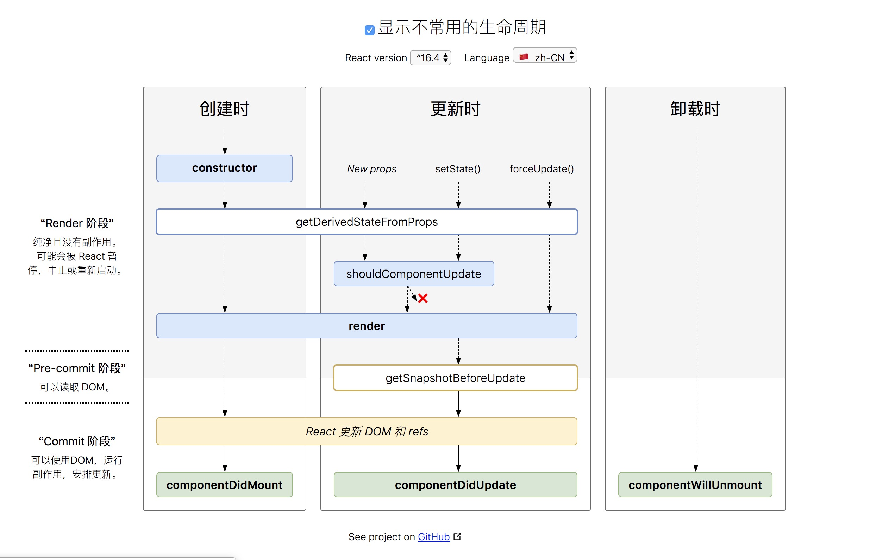

# 生命周期

## Mounting 装载阶段

在创建组件实例到将其插入到 dom 的过程中，会依次调用以下生命周期

- constructor()
- static getDerivedStateFromProps()
- render()
- componentDidMount()

> ⚠️ componentWillMount() 已经不再再建议使用

### render()

该方法在class component 下必须实现，并且应该设计为一个纯函数，没有任何副作用（不能改变 state 和 props 以及操作 dom），保持相同的输入时输出不变。render() 函数可能返回以下几种类型的数据。

- React elements: 可以是原生html tag，也可以是自定义组件
- Arrays and fragments: 可以返回`多个同一层级的组件`，不需要`div`包裹
- Portals: 插槽 允许你渲染 dom 到不同的 dom tree 下
- string and number: 返回 react text 类型节点
- boolean or null: 不会渲染任何东西

## Updating 存在期

组件实例以及存在，当状态或者属性发生变更导致一个更新时，会一次调用以下生命周期

- static getDerivedStateFromProps()
- shouldComponentUpdate()
- render()
- getSnapshotBeforeUpdate()
- componentDidUpdate()

> ⚠️ componentWillReceiveProps() 和 componentWillUpdate() 已经不再再建议使用

## Unmounting 卸载

从 dom 中删除该组件时，调用该方法

- componentWillUnMount()

## 错误处理 React 16 新增

在渲染过程中，生命周期或者子组件的 constructor()方法发生错误时，以下方法会捕捉到错误

- static getDerivedStateFromError()
- componentDidCatch()

## 其他 API

- setState() 重置状态，可能是异步的
- forceUpdate() 强制更新
- displayName
- defaultProps 默认属性
- props 属性
- state 状态

## React 16.4 生命周期图

